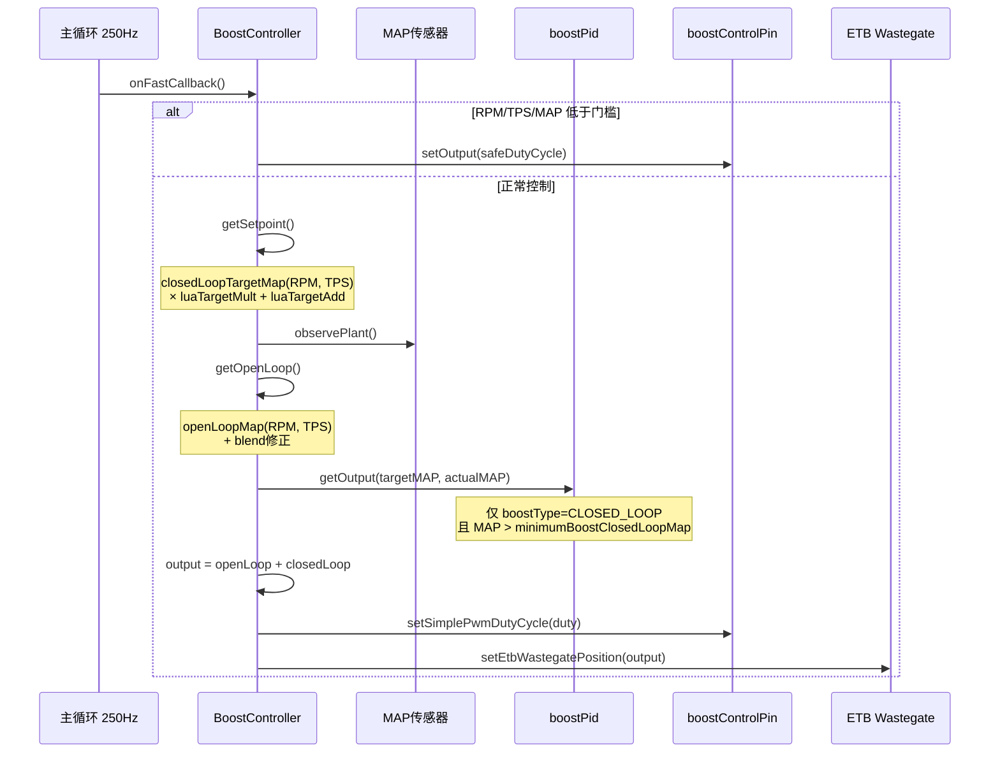

# 增压控制场景分析

## 1. 场景描述

控制涡轮增压器的废气旁通阀（Wastegate）或 VGT 执行器，调节进气增压压力（MAP）。采用与 ETB/VVT 相同的 `ClosedLoopController` 框架：**开环前馈 + PID 闭环**。

---

## 2. 数据流

```
主循环 250Hz: BoostController::onFastCallback()
  ├─ 门槛检查: RPM / TPS / MAP 低于最小值 → 安全占空比
  └─ ClosedLoopController::update()
       ├─ getSetpoint()     → boostTableClosedLoop(RPM, TPS) 目标 MAP
       ├─ observePlant()    → Sensor::Map 实际 MAP
       ├─ getOpenLoop()     → boostTableOpenLoop(RPM, TPS) 前馈占空比
       ├─ getClosedLoop()   → PID(目标MAP, 实际MAP) 修正量
       └─ setOutput()       → PWM 占空比 + setEtbWastegatePosition()
```

---

## 3. 调用时序图



---

## 4. 关键代码分析

### 4.1 目标增压

```65:102:firmware/controllers/actuators/boost_control.cpp
expected<float> BoostController::getSetpoint() {
	if (engineConfiguration->boostType != CLOSED_LOOP) {
		return 0;  // 纯开环模式不算目标
	}
	float target = m_closedLoopTargetMap->getValue(xAxis.Value, yAxis.Value);
	// + boostClosedLoopBlends 修正
	return target * luaTargetMult + luaTargetAdd;
}
```

开环/闭环表使用独立的 X/Y 轴配置（默认均为 RPM × TPS），支持 `calculateBlend()` 动态修正。

### 4.2 开环前馈

```105:141:firmware/controllers/actuators/boost_control.cpp
expected<percent_t> BoostController::getOpenLoop(float target) {
	UNUSED(target);  // 开环不依赖目标值，只看 RPM/TPS
	float openLoop = luaOpenLoopAdd + m_openLoopMap->getValue(xAxis.Value, yAxis.Value);
	// + boostOpenLoopBlends
	return clampF(0, openLoop, 100);
}
```

**要点**：开环表提供"大致正确的占空比"，闭环 PID 只做小修正——这是 turbo 控制的经典策略，避免 PID 独自承担大范围控制。

### 4.3 闭环 PID

```144:170:firmware/controllers/actuators/boost_control.cpp
percent_t BoostController::getClosedLoopImpl(float target, float manifoldPressure) {
	if (engineConfiguration->boostType != CLOSED_LOOP) {
		return 0;
	}
	if (Sensor::getOrZero(SensorType::Rpm) == 0) {
		m_pid.reset();
		return 0;
	}
	if (manifoldPressure < engineConfiguration->minimumBoostClosedLoopMap) {
		m_pid.reset();  // MAP 太低时不闭环，防止积分 windup
		return 0;
	}
	return m_pid.getOutput(target, manifoldPressure, FAST_CALLBACK_PERIOD_MS / 1000.0f);
}
```

PID 输出限制 ±20%（`iTermMin/Max = -20/20`），修正量相对较小。

### 4.4 输出与安全模式

```183:219:firmware/controllers/actuators/boost_control.cpp
void BoostController::setOutput(expected<float> output) {
	boostOutput = output.value_or(engineConfiguration->boostControlSafeDutyCycle);
	if (!engineConfiguration->isBoostControlEnabled) {
		boostOutput = 0;
	}
	m_pwm->setSimplePwmDutyCycle(PERCENT_TO_DUTY(boostOutput));
	setEtbWastegatePosition(boostOutput);  // ETB 型 WG 执行器
}

void BoostController::onFastCallback() {
	if (rpmTooLow || tpsTooLow || mapTooLow) {
		setOutput(unexpected);  // → safeDutyCycle
	} else {
		ClosedLoopController::update();
	}
}
```

`unexpected` 输出时使用用户配置的 `boostControlSafeDutyCycle`——通常是 WG 全开（最小增压）的安全状态。

---

## 5. 执行器类型

| 类型 | 控制方式 | 代码路径 |
|------|---------|---------|
| PWM 电磁阀 | `boostControlPin` PWM | `setSimplePwmDutyCycle()` |
| ETB 型 WG | DC 电机 H 桥 | `setEtbWastegatePosition()` |
| VGT | PWM 执行器 | 同上 PWM 路径 |

---

## 6. 保护策略

LimpManager 可在以下情况降低目标增压或强制安全占空比：
- 进气温度过高
- 冷却液温度过高
- 爆震检测
- MAP 超过极限

具体逻辑在 `limp_manager.cpp` 中与各子系统联动。

---

## 7. 默认 PID 参数

```222:228:firmware/controllers/actuators/boost_control.cpp
engineConfiguration->boostPid.pFactor = 0.5;
engineConfiguration->boostPid.iFactor = 0.3;
engineConfiguration->boostPid.maxValue = 20;
engineConfiguration->boostPid.minValue = -20;
```

---

## 8. 设计权衡

- **开环不依赖目标 MAP**：turbo 响应滞后，开环表按 RPM/TPS 预置占空比比按目标 MAP 查表更稳定。
- **低 MAP 时禁用闭环**：避免在 WG 即将关闭时 PID 积分 windup，导致超调。
- **双执行器路径**：传统 PWM 阀和 ETB 型 WG 共用 BoostController 逻辑，输出分流到不同硬件。
