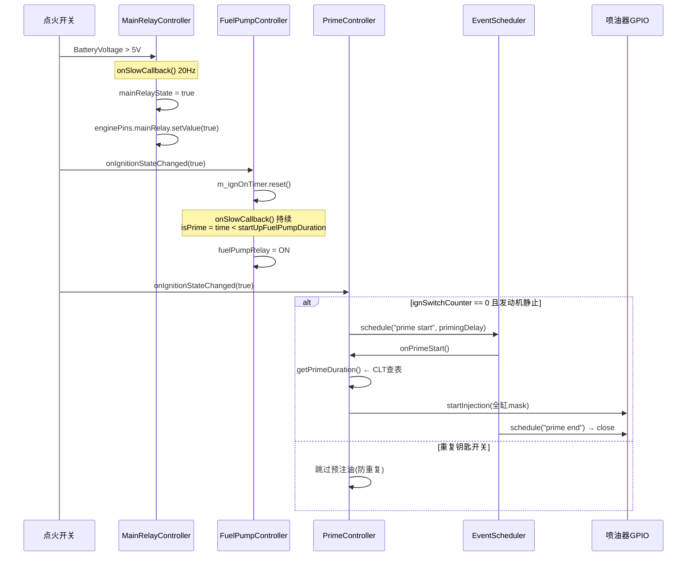
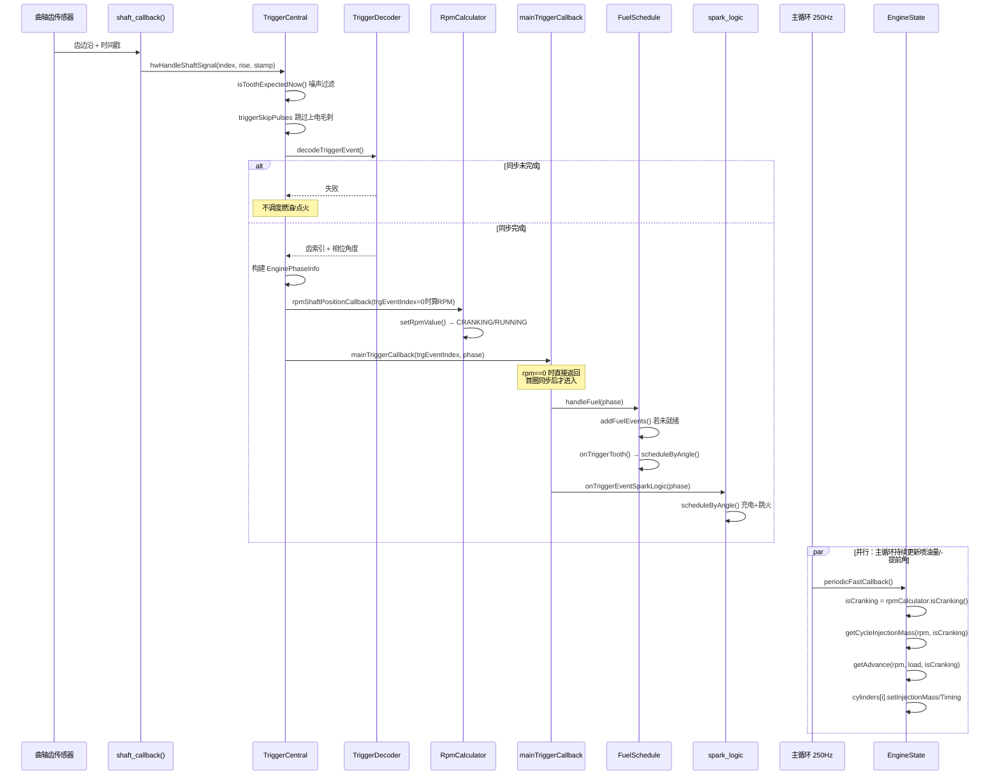

# 起动场景分析

## 1. 场景描述

发动机从静止到自主运转的完整过程，横跨三个时间尺度：

| 阶段 | 时间尺度 | 主要动作 |
|------|---------|---------|
| 钥匙 ON | 秒级 | 主继电器吸合、燃油泵预润、预注油 |
| 起动机拖动 | 100–2000 ms | 触发同步、RPM 建立、首次喷油/点火 |
| 起动完成 | 数秒 | RPM 超过阈值 → 进入 RUNNING，IAC 渐变到怠速 |

核心约束：**在曲轴相位未知之前不能喷油/点火**，否则可能在排气行程喷油（浪费 + 回火风险）。

---

## 2. 数据流

```
钥匙 ON
  ├─ MainRelayController::onSlowCallback()     → 主继电器吸合
  ├─ FuelPumpController::onIgnitionStateChanged() → 预润泵 (startUpFuelPumpDuration)
  └─ PrimeController::onIgnitionStateChanged()  → 延迟后全缸预注油

起动机拖动曲轴
  └─ GPIO EXTI 中断
       └─ hwHandleShaftSignal()
            └─ TriggerCentral::handleShaftSignal()
                 ├─ decodeTriggerEvent()        → 齿间隙比同步，确认曲轴相位
                 ├─ rpmShaftPositionCallback()  → 计算 RPM，更新 CRANKING 状态
                 └─ mainTriggerCallback()       → 按角度调度喷油/点火

主循环 250 Hz (与触发中断并行)
  └─ EngineState::periodicFastCallback()
       ├─ rpmCalculator.isCranking()           → 选择起动/运行算法分支
       ├─ getCycleInjectionMass(rpm, isCranking) → 计算本周期喷油量
       ├─ getAdvance(rpm, load, isCranking)    → 计算点火提前角
       └─ cylinders[i].setInjectionMass/Timing  → 写入每缸数据，供触发回调使用

RPM ≥ cranking.rpm (默认 550)
  └─ RpmCalculator::setRpmValue() → state = RUNNING
       └─ IdleTargetController → CrankToIdleTaper → Idling
```

---

## 3. 调用时序图

### 3.1 钥匙 ON：预润与预注油



### 3.2 起动机拖动：每个触发齿的完整路径



---

## 4. 关键代码分析

### 4.1 触发信号入口（中断上下文）

硬件 EXTI 回调读取引脚电平后立即转发，不在 ISR 中做复杂计算：

```31:40:firmware/hw_layer/digital_input/trigger/trigger_input_exti.cpp
static void shaft_callback(void* arg, efitick_t stamp) {
	// do the time sensitive things as early as possible!
	int index = (int)arg;
	ioline_t pal_line = shaftLines[index];
	bool rise = (palReadLine(pal_line) == PAL_HIGH);

	// todo: support for 3rd trigger input channel
	// todo: start using real event time from HW event, not just software timer?

	hwHandleShaftSignal(index, rise, stamp);
}
```

`hwHandleShaftSignal` 在自激模拟模式下会丢弃外部信号，避免噪声与模拟器冲突：

```392:405:firmware/controllers/trigger/trigger_central.cpp
void hwHandleShaftSignal(int signalIndex, bool isRising, efitick_t timestamp) {
	TriggerCentral* tc = getTriggerCentral();
	ScopePerf perf(PE::HandleShaftSignal);

	/* 自激模拟时忽略外部信号:
	 * 当使用触发模拟器(triggerSimulatorRpm)时,应忽略真实的硬件信号
	 * 否则外部噪声+模拟信号会导致同步丢失
	 */
	if (tc->directSelfStimulation || !tc->hwTriggerInputEnabled) {
		return;
	}

	handleShaftSignal(signalIndex, isRising, timestamp);
}
```

### 4.2 触发解码与同步

每个齿经过三层过滤后才进入解码器：

1. `isToothExpectedNow()` — 滤除加倍边沿和时序异常齿
2. `triggerSkipPulses` — 跳过上电初期的虚假脉冲
3. `decodeTriggerEvent()` — 间隙比匹配同步点

同步成功后，构建 `EnginePhaseInfo` 并依次调用 RPM 计算、主触发回调：

```649:742:firmware/controllers/trigger/trigger_central.cpp
	// Decode the trigger!
	auto decodeResult = triggerState.decodeTriggerEvent(
			"trigger", triggerShape, engine, primaryTriggerConfiguration, signal, timestamp);

	// Don't propagate state if we don't know where we are
	if (!decodeResult) {
		// ...
		return;
	}
	// ... 计算 currentTrgPhase / currentEngPhase ...

	const EnginePhaseInfo phaseInfo{
			.timestamp = timestamp,
			.currentTrgPhase = currentTrgPhase,
			.nextTrgPhase = nextPhase,
			.currentEngPhase = currentEnginePhase,
			.nextEngPhase = toEngPhase(nextPhase),
	};

	// Update engine RPM
	rpmShaftPositionCallback(triggerIndexForListeners, phaseInfo);

	// Schedule the TDC mark
	tdcMarkCallback(triggerIndexForListeners, timestamp);

	// Handle ignition and injection
	mainTriggerCallback(triggerIndexForListeners, phaseInfo);
```

**要点**：`decodeResult` 为 false 时整个回调链终止——这就是为什么同步完成前不会有喷油/点火。

### 4.3 RPM 状态机与起动判定

RPM 状态决定后续所有算法走"起动"还是"运行"分支：

```46:49:firmware/controllers/engine_cycle/rpm_calculator.cpp
bool RpmCalculator::isCranking() const {
	// Spinning-up with non-zero RPM is suitable for all engine math, as good as cranking
	return state == CRANKING || (state == SPINNING_UP && cachedRpmValue > 0);
}
```

状态转换在 `setRpmValue()` 中完成，带滞回设计——一旦进入 RUNNING，RPM 短暂回落不会退回 CRANKING：

```161:184:firmware/controllers/engine_cycle/rpm_calculator.cpp
void RpmCalculator::setRpmValue(float value) {
	// ...
	assignRpmValue(value);

	// Change state
	if (cachedRpmValue == 0) {
		state = STOPPED;
	} else if (cachedRpmValue >= engineConfiguration->cranking.rpm) {
		if (state != RUNNING) {
			// Store the time the engine started
			engineStartTimer.reset();
		}

		state = RUNNING;
	} else if (state == STOPPED || state == SPINNING_UP) {
		/**
		 * We are here if RPM is above zero but we have not seen running RPM yet.
		 * This gives us cranking hysteresis - a drop of RPM during running is still running, not cranking.
		 */
		state = CRANKING;
	}
}
```

默认 `cranking.rpm = 550`（`default_cranking.cpp`）。`revolutionCounterSinceStart` 在每个发动机周期（同步点）递增，驱动起动转数衰减。

### 4.4 主触发回调：角度调度入口

`mainTriggerCallback` 是燃油和点火的唯一调度入口。RPM 为 0 时（同步后首圈尚未算出 RPM）直接返回：

```73:95:firmware/controllers/engine_cycle/main_trigger_callback.cpp
void mainTriggerCallback(uint32_t trgEventIndex, const EnginePhaseInfo& phase) {
	ScopePerf perf(PE::MainTriggerCallback);

	if (hasFirmwareError()) {
		return;
	}

	float rpm = engine->rpmCalculator.getCachedRpm();
	if (rpm == 0) {
		// this happens while we just start cranking
		return;
	}
	// ...
	handleFuel(phase);
	onTriggerEventSparkLogic(phase);
}
```

`handleFuel` 在调度未就绪时立即重建（避免等 250 Hz 回调才首次喷油）：

```39:59:firmware/controllers/engine_cycle/main_trigger_callback.cpp
static void handleFuel(const EnginePhaseInfo& phase) {
	// ...
	FuelSchedule* fs = getFuelSchedule();
	if (!fs->isReady) {
		fs->addFuelEvents();
	}

	fs->onTriggerTooth(phase);
}
```

`InjectionEvent::onTriggerTooth` 读取 `cylinders[i].getInjectionMass()`（由快速回调写入），通过 `scheduleByAngle()` 在精确曲轴角度开关喷油器。

### 4.5 快速回调：喷油量与点火角计算

主循环 250 Hz 调用 `EngineState::periodicFastCallback()`，与触发中断并行运行。它负责**计算**每缸喷油量和点火角，触发回调负责**调度**：

```87:193:firmware/controllers/algo/engine2.cpp
void EngineState::periodicFastCallback() {
	// ...
	bool isCranking = engine->rpmCalculator.isCranking();
	float rpm = Sensor::getOrZero(SensorType::Rpm);

	if (isCranking) {
		crankingTimer.reset(nowNt);
	}

	engine->ignitionState.updateDwell(rpm, isCranking);
	// ... post-cranking enrichment ...

	float cycleFuelMass =
			getCycleInjectionMass(rpm, isCranking) * engine->engineState.lua.fuelMult + engine->engineState.lua.fuelAdd;
	// ... injection duration, offset ...

	float untrimmedAdvance =
			engine->ignitionState.getAdvance(rpm, ignitionLoad, isCranking) * engine->ignitionState.luaTimingMult +
			engine->ignitionState.luaTimingAdd;

	// Now apply that to per-cylinder fueling and timing
	for (size_t i = 0; i < engineConfiguration->cylindersCount; i++) {
		// ...
		engine->cylinders[i].setInjectionMass(cycleFuelMass * bankTrim * cylinderTrim);
		engine->cylinders[i].setIgnitionTimingBtdc(untrimmedAdvance + getCylinderIgnitionTrim(i, rpm, ignitionLoad));
	}
}
```

`getCycleInjectionMass` 在 `isCranking=true` 时走 `getCrankingFuel()` 分支，跳过运行时的 CLT/IAT/DFCO 等修正。

### 4.6 起动燃油三因素模型

```62:146:firmware/controllers/algo/fuel_math.cpp
float getCrankingFuel3(float baseFuel, uint32_t revolutionCounterSinceStart) {
	// 基础油量: cranking.baseFuel (mg) 或 useRunningMathForCranking 时用运行算法
	// ...

	// 系数1: 转数衰减 — crankingCycleBins/Coef 查表
	engine->engineState.crankingFuel.durationCoefficient =
			interpolate2d(revolutionCounterSinceStart, config->crankingCycleBins, config->crankingCycleCoef);

	// 系数2: 水温加浓 — crankingFuelBins/Coef 查表
	auto clt = Sensor::get(SensorType::Clt).value_or(20);
	auto e0Mult = interpolate2d(clt, config->crankingFuelBins, config->crankingFuelCoef);
	// flexCranking 时在汽油/E85 曲线间插值 ...

	// 系数3: TPS 修正 — 清缸/手动加浓
	engine->engineState.crankingFuel.tpsCoefficient =
			tps.Valid ? interpolate2d(tps.Value, config->crankingTpsBins, config->crankingTpsCoef) : 1;

	floatms_t crankingFuel = baseCrankingFuel * durationCoefficient * coolantTemperatureCoefficient * tpsCoefficient;
	return crankingFuel;
}
```

默认曲线（`default_cranking.cpp`）：
- 第 1 转：`crankingCycleCoef[0] = 2.0`（双倍加浓，建立油膜）
- 第 2 转：`1.3`
- 之后：`1.0`
- -20°C 水温：`crankingFuelCoef = 2.8`（接近 3 倍加浓）

### 4.7 起动点火提前角与 Dwell

起动时使用独立的点火表，并在最低 RPM 到 `cranking.rpm` 之间线性过渡：

```165:210:firmware/controllers/algo/ignition/ignition_state.cpp
static angle_t getCrankingAdvance(float rpm, float engineLoad) {
	if (engineConfiguration->useSeparateAdvanceForCranking) {
		return interpolate2d(rpm, config->crankingAdvanceBins, config->crankingAdvance);
	}

	angle_t crankingToRunningTransitionAngle = getRunningAdvance(engineConfiguration->cranking.rpm, engineLoad);
	if (rpm < minCrankingRpm || minCrankingRpm == 0) {
		minCrankingRpm = rpm;
	}

	return interpolateClamped(
			minCrankingRpm,
			engineConfiguration->crankingTimingAngle,   // 默认 6° BTDC
			engineConfiguration->cranking.rpm,             // 默认 550 RPM
			crankingToRunningTransitionAngle,
			rpm);
}

angle_t IgnitionState::getAdvance(float rpm, float engineLoad, bool isCranking) {
	if (isCranking) {
		angle = getCrankingAdvance(rpm, engineLoad);
	} else {
		angle = getRunningAdvance(rpm, engineLoad);
	}
	angle += getAdvanceCorrections(isCranking);
	return angle;
}
```

起动 Dwell 使用固定值 `ignitionDwellForCrankingMs`（默认 6 ms），不查 RPM/电压表——低转速时角度 dwell 过长会导致线圈过热：

```258:262:firmware/controllers/algo/ignition/ignition_state.cpp
floatms_t IgnitionState::getSparkDwell(float rpm, bool isCranking) {
	float dwellMs;
	if (isCranking) {
		dwellMs = engineConfiguration->ignitionDwellForCrankingMs;
```

### 4.8 预注油

钥匙 ON 时、发动机完全静止的情况下，全缸同时喷一次：

```48:84:firmware/controllers/engine_cycle/prime_injection.cpp
void PrimeController::onIgnitionStateChanged(bool ignitionOn) {
	if (!ignitionOn) {
		return;
	}
	// ...
	if (ignSwitchCounter == 0) {
		uint32_t primeDelayNt = MSF2NT(engineConfiguration->primingDelay * 1000 + minimumPrimeDelayMs);
		auto startTime = getTimeNowNt() + primeDelayNt;
		getScheduler()->schedule("prime start", nullptr, startTime, {PrimeController::onPrimeStartAdapter, this});
	}
	setKeyCycleCounter(ignSwitchCounter + 1);
}
```

注油量由 `primeBins/primeValues` 按 CLT 查表。发动机一旦开始转动（`!isStopped()`），计数器清零，下次钥匙 ON 可再次预注。

### 4.9 燃油泵与主继电器

燃油泵在点火 ON 后的 `startUpFuelPumpDuration` 内预润，之后只要检测到曲轴最近有转动就保持开启：

```16:29:firmware/controllers/modules/fuel_pump/fuel_pump.cpp
void FuelPumpController::onSlowCallback() {
	auto timeSinceIgn = m_ignOnTimer.getElapsedSeconds();

	isPrime = timeSinceIgn >= 0 && timeSinceIgn < engineConfiguration->startUpFuelPumpDuration;

	engineTurnedRecently = engine->triggerCentral.engineMovedRecently();

	isFuelPumpOn = isPrime || engineTurnedRecently || m_forceState;
	enginePins.fuelPumpRelay.setValue(isFuelPumpOn);
}
```

主继电器在起动机接合瞬间不会被误断——`needsDelayedShutoff()` 在点火电压消失后仍保持 1 秒：

```56:60:firmware/controllers/actuators/main_relay.cpp
bool MainRelayController::needsDelayedShutoff() {
	// Prevent main relay from turning off if we had igniton voltage in the past 1 second
	// This avoids accidentally killing the car during a transient, for example
	// right when the starter is engaged.
	return !m_lastIgnitionTime.hasElapsedSec(1);
}
```

### 4.10 起动后 IAC 渐变

RPM 超过 `cranking.rpm` 后，`IdleTargetController` 进入 `CrankToIdleTaper` 阶段：

```119:127:firmware/controllers/actuators/idle_thread.cpp
float IdleTargetController::getCrankingTaperFraction(float clt) const {
	float taperDuration = engineConfiguration->afterCrankingIACtaperDuration;

	if (engineConfiguration->useCrankingIdleTaperTableSetting) {
		taperDuration *= interpolate2d(clt, config->cltCrankingTaperCorrBins, config->cltCrankingTaperCorr);
	}

	return (float)engine->rpmCalculator.getRevolutionCounterSinceStart() / taperDuration;
}
```

`taperFraction` 从 0→1 线性增长，IAC 位置从 `crankingIACposition`（默认 50%）渐变到 `cltIdleCorr` 查表值。默认 `afterCrankingIACtaperDuration = 200` 转。

---

## 5. 典型时序（参考值）

实际时间取决于触发轮齿数、气缸数和起动机转速，以下为 4 缸 60-2 触发轮的典型值：

```
T=0ms:     钥匙 ON → 主继电器吸合，燃油泵预润
T=100ms:   预注油脉冲（全缸同时）
T=500ms:   起动机啮合，曲轴开始旋转
T=550ms:   触发解码器完成首次同步（约 1–2 圈）
T=600ms:   RPM > 0，首次 calculate fuel/spark
T=650ms:   第一个喷油事件（同步后的第一个匹配角度）
T=700ms:   第一个点火事件
T=1200ms:  首个气缸点燃，RPM 200→600
T=2000ms:  RPM ≥ 550 → state = RUNNING，起动机脱开
T=5000ms:  IAC 渐变完成，进入正常怠速控制
```

---

## 6. 关键配置参数

| 参数 | 默认值 | 作用 |
|------|--------|------|
| `cranking.rpm` | 550 | RUNNING 判定阈值 |
| `cranking.baseFuel` | 27 mg | 起动基础喷油量 |
| `crankingTimingAngle` | 6° BTDC | 最低 RPM 时的点火提前角 |
| `ignitionDwellForCrankingMs` | 6 ms | 起动 Dwell 固定值 |
| `crankingIACposition` | 50% | 起动时 IAC 开度 |
| `afterCrankingIACtaperDuration` | 200 转 | IAC 渐变持续时间 |
| `crankingInjectionMode` | Simultaneous | 起动喷射模式（全缸同时） |
| `startUpFuelPumpDuration` | — | 预润泵持续时间 |
| `triggerSkipPulses` | — | 上电跳过的虚假脉冲数 |

---

## 7. 设计权衡

- **同步后才喷油/点火**：相位未知时在排气行程喷油会直接排出排气管；在压缩行程点火可能回火。间隙比同步与转速无关，使解码器从 100 RPM 到 600 RPM 均可靠。
- **快速回调计算 + 触发回调调度分离**：250 Hz 主循环负责"算多少油/什么角度"，中断驱动的触发回调负责"在什么角度执行"。这样中断路径保持简短，复杂数学不在 ISR 中运行。
- **起动油量远超理论值**：冷机时燃油在气缸壁凝结，真正参与燃烧的仅一小部分。转数衰减模拟油膜建立过程——前几转需要最大加浓，之后逐步减少。
- **SPINNING_UP 状态**：`isFasterEngineSpinUpEnabled` 开启时，同步前即用瞬时 RPM 驱动算法，使首圈喷油/点火不必等到完整一圈 RPM 计算完成。
- **起动 Dwell 用固定毫秒而非角度**：低 RPM 时按角度计算的 dwell 会极长，线圈持续通电导致过热。固定 ms 值保证火花能量一致。
