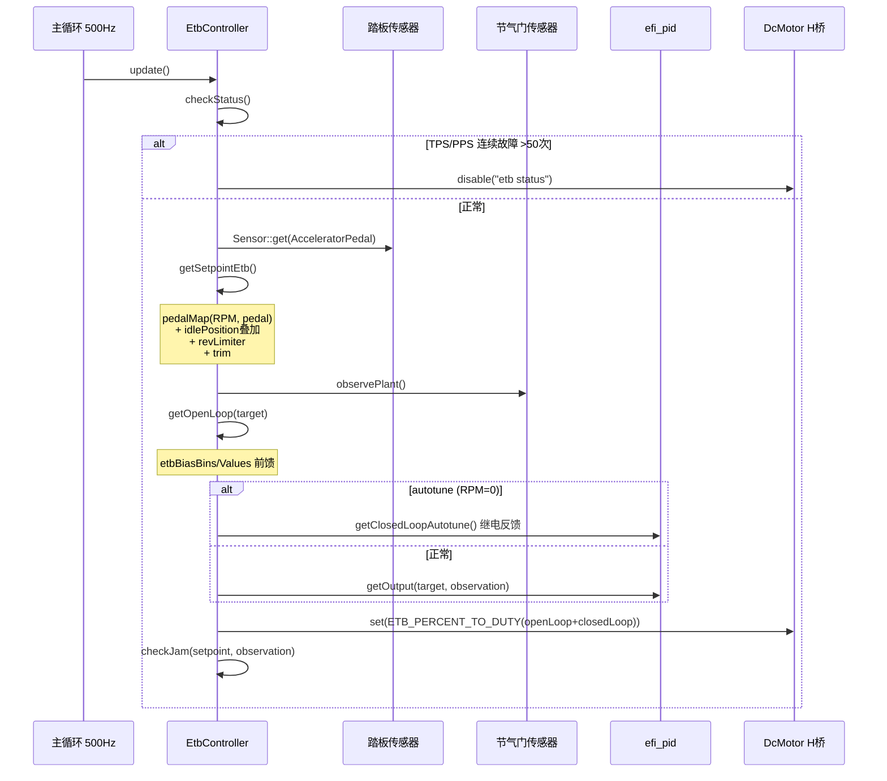

# 电子节气门场景分析

## 1. 场景描述

驾驶员踩下油门后，ECU 控制 H 桥电机驱动节气门翻板到目标开度。这是**安全关键**系统——传感器冗余、卡滞检测、跛行模式均为强制要求。控制频率锁定 **500 Hz**（与 ADC 采样率一致，满足 Nyquist 定理）。

---

## 2. 数据流

```
主循环 500Hz: EtbController::update()
  ├─ checkStatus()              → TPS/PPS 健康检查，计数 >50 次故障
  ├─ ClosedLoopController::update()
  │    ├─ getSetpoint()         → 踏板映射 / 扭矩模型 / 怠速叠加 / 限速
  │    ├─ observePlant()        → TPS1/TPS2 冗余读数
  │    ├─ getOpenLoop(target)   → etbBias 前馈表
  │    ├─ getClosedLoop()       → PID 或 Autotune 继电反馈
  │    └─ output = openLoop + closedLoop
  └─ setOutput() → DcMotor::set(duty)

外部输入:
  ├─ setEtbIdlePosition()       ← IdleController
  ├─ setEtbWastegatePosition()  ← BoostController
  └─ setEtbLuaAdjustment()      ← Lua 脚本
```

---

## 3. 调用时序图



---

## 4. 关键代码分析

### 4.1 统一闭环框架

ETB、增压、VVT 均继承 `ClosedLoopController`：

```12:43:firmware/controllers/closed_loop_controller.h
void update() {
	expected<TOutput> setpoint = getSetpoint();
	expected<TInput> observation = observePlant();
	expected<TOutput> openLoopResult = getOpenLoop(setpoint.Value);
	expected<TOutput> closedLoopResult = getClosedLoop(setpoint.Value, observation.Value);
	return openLoopResult.Value + closedLoopResult.Value;
}
```

任一步骤失败（传感器无效、setpoint 无法计算）→ `setOutput(unexpected)` → 电机禁用。

### 4.2 目标位置计算

```272:336:firmware/controllers/actuators/electronic_throttle.cpp
expected<percent_t> EtbController::getSetpointEtb() {
	auto pedalPosition = Sensor::get(SensorType::AcceleratorPedal);
	float pedalTableValue = m_pedalMap->getValue(rpm, sanitizedPedal);

	float targetPosition = engineConfiguration->enableTorqueModel
		? getSetpointEtbTorqueModel(pedalTableValue)
		: getSetpointEtbNonTorqueModel(pedalTableValue);

	targetPosition += getThrottleTrim(rpm, targetPosition);  // ±10% clamp
	targetPosition = clampF(0, targetPosition, 100);

	// ETB rev limiter: RPM > etbRevLimitStart 时线性关小节气门
	targetPosition = interpolateClamped(etbRpmLimit, targetPosition, fullyLimitedRpm, 0, rpm);
	return targetPosition;
}
```

非扭矩模式的怠速叠加：

```339:358:firmware/controllers/actuators/electronic_throttle.cpp
percent_t EtbController::getSetpointEtbNonTorqueModel(percent_t pedalTableValue) const {
	percent_t etbIdleAddition = PERCENT_DIV * etbIdleThrottleRange * m_idlePosition;
	// [0,100] 踏板表值 → [idle, 100] 实际目标
	return interpolateClamped(0, etbIdleAddition, 100, 100, pedalTableValue) + getLuaAdjustment();
}
```

**要点**：`etbIdleThrottleRange` 压缩踏板行程——怠速区域占全行程的一部分，踏板从 0% 开始对应 idle 位置而非全关。

### 4.3 前馈（非线性补偿）

```392:402:firmware/controllers/actuators/electronic_throttle.cpp
expected<percent_t> EtbController::getOpenLoop(percent_t target) {
	if (m_function != DC_Wastegate) {
		feedForward = interpolate2d(target, config->etbBiasBins, config->etbBiasValues);
	}
	return feedForward;
}
```

前馈非线性原因：低开度时文丘里效应吸力大，需更高占空比；中开度气动力与弹簧平衡；大开度弹簧力主导。

### 4.4 PID 闭环与卡滞检测

```492:510:firmware/controllers/actuators/electronic_throttle.cpp
expected<percent_t> EtbController::getClosedLoop(percent_t target, percent_t observation) {
	if (m_isAutotune) {
		return getClosedLoopAutotune(target, observation);
	}
	checkJam(target, observation);
	m_error = target - observation;
	return m_pid.getOutput(target, observation, etbPeriodSeconds);
}
```

卡滞检测：`absError > etbJamDetectThreshold` 持续 `etbJamTimeout` 秒 → 报告 ETB 故障 → LimpManager 限制节气门。

### 4.5 传感器冗余校验

```533:596:firmware/controllers/actuators/electronic_throttle.cpp
bool EtbController::checkStatus() {
	if (isTpsError && !hadTpsError) { etbTpsErrorCounter++; }
	if (isPpsError && !hadPpsError) { etbPpsErrorCounter++; }
	if (etbTpsErrorCounter > 50) { localReason = TpsState::IntermittentTps; }
	if (etbPpsErrorCounter > 50) { localReason = TpsState::IntermittentPps; }
	return localReason == TpsState::None;
}
```

主副传感器通常成比例（TPS2 ≈ TPS1 × 0.5）——比值偏离预期说明电路故障，而非简单的"读数不等"。

### 4.6 PID 自整定（Åström-Hägglund）

```405:447:firmware/controllers/actuators/electronic_throttle.cpp
expected<percent_t> EtbController::getClosedLoopAutotune(percent_t target, percent_t actualThrottlePosition) {
	// Bang-bang: 目标附近 ±20% 开关控制，诱导振荡
	return autotuneAmplitude * (actualThrottlePosition > target ? -1 : 1);
	// 每个周期记录振幅 A 和周期 T_u
	// K_u = 4b / (πA),  Z-N: Kp=0.35Ku, Ki=0.25Ku/Tu, Kd=0.08Ku×Tu
}
```

仅在 **RPM = 0** 且 `etbAutoTune` 开启时运行——避免行驶中振荡。

### 4.7 扭矩模式

```361:366:firmware/controllers/actuators/electronic_throttle.cpp
percent_t EtbController::getSetpointEtbTorqueModel(percent_t pedalTableValue) const {
	percent_t torqueModelThrottle = engine->module<TorqueModel>()->getThrottleRequest();
	return std::min(torqueModelThrottle, pedalTableValue);  // 踏板表作为安全上限
}
```

踏板表示"扭矩请求"而非"节气门位置"——ECU 根据 RPM/IAT/海拔计算所需节气门开度，相同踏板产生一致的加速响应。

---

## 5. 与怠速/增压的交互

| 来源 | 接口 | 作用 |
|------|------|------|
| IdleController | `setEtbIdlePosition(pos)` | 怠速时额外开度 |
| BoostController | `setEtbWastegatePosition(duty)` | ETB 型废气旁通阀 |
| Lua | `setEtbLuaAdjustment(±%)` | 0.2s 超时自动失效 |

---

## 6. 常见问题

| 问题 | 原因 | 解决方案 |
|------|------|---------|
| 节气门振荡 | Ki 过大 | 自整定或减小 Ki |
| 响应迟滞 | Kp 过小 / 前馈不准 | 校准 etbBias 表 |
| 怠速不稳 | idle 叠加不当 | 调整 etbIdleThrottleRange |
| 加速窜动 | 踏板映射过陡 | 调整 pedalToTpsTable |

---

## 7. 设计权衡

- **500 Hz 固定频率**：安全关键系统不允许用户修改更新率；与 ADC 同步避免采样混叠。
- **踏板失效时用 0% 而非禁用 ETB**：比完全失去节气门控制更安全——至少能关小节气门让发动机怠速。
- **Lua 调整 0.2s 超时**：防止脚本卡死导致节气门 stuck open。
