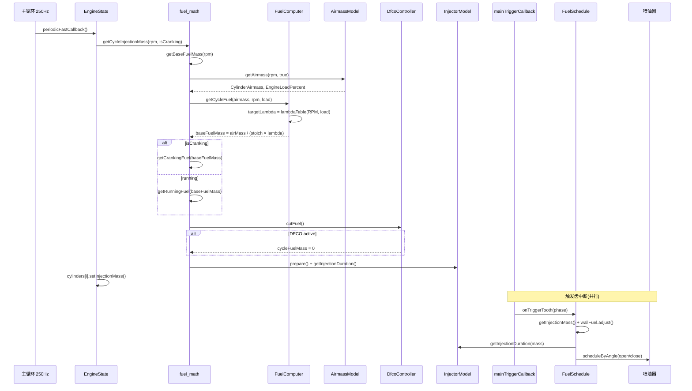

# 燃油控制场景分析

## 1. 场景描述

燃油控制是 ECU 的核心功能：在每个发动机周期计算正确的喷油量，使实际空燃比接近目标 Lambda。计算在 **250 Hz 主循环**中完成，结果写入每缸状态；**触发中断**按曲轴角度执行实际喷油。

---

## 2. 数据流

```
主循环 250Hz: EngineState::periodicFastCallback()
  └─ getCycleInjectionMass(rpm, isCranking)
       ├─ getBaseFuelMass(rpm)
       │    ├─ getAirmassModel() → Speed-Density / MAF / Alpha-N / Lua
       │    ├─ model->getAirmass() → 每缸空气量 + 负荷轴
       │    └─ fuelComputer.getCycleFuel(airmass, rpm, load)
       │         └─ fuelMass = airMass / (stoich × targetLambda)
       ├─ getCrankingFuel() 或 getRunningFuel()  ← isCranking 分支
       ├─ DfcoController::cutFuel() → 可能归零
       ├─ InjectorModel::prepare() → 计算 dead time
       └─ TpsAccelEnrichment → 加速补偿质量

  └─ cylinders[i].setInjectionMass()  → 供触发回调读取

触发中断: mainTriggerCallback()
  └─ FuelSchedule::onTriggerTooth()
       ├─ wallFuel.adjust(mass)        → 壁膜修正
       ├─ InjectorModel::getInjectionDuration(mass)
       └─ scheduleByAngle() → 开/关喷油器
```

---

## 3. 调用时序图



---

## 4. 关键代码分析

### 4.1 空气量 → 基础喷油量

```245:296:firmware/controllers/algo/fuel_math.cpp
static float getBaseFuelMass(float rpm) {
	auto model = getAirmassModel(engineConfiguration->fuelAlgorithm);
	auto airmass = model->getAirmass(rpm, true);
	// ... 写入 fuelingLoad, airflowEstimate ...
	float baseFuelMass = engine->fuelComputer.getCycleFuel(airmass.CylinderAirmass, rpm, airmass.EngineLoadPercent);
	baseFuelMass *= engineConfiguration->globalFuelCorrection;
	return baseFuelMass;
}
```

核心转换在 `FuelComputer::getCycleFuel`：

```16:28:firmware/controllers/algo/fuel/fuel_computer.cpp
mass_t FuelComputerBase::getCycleFuel(mass_t airmass, float rpm, float load) {
	load = getTargetLambdaLoadAxis(load);
	float stoich = getStoichiometricRatio();
	float lambda = getTargetLambda(rpm, load);
	float afr = stoich * lambda;
	targetLambda = lambda;
	return airmass / afr;
}
```

**要点**：`lambdaTable`（3D: RPM × 负荷）决定目标 Lambda；有乙醇传感器时在汽油/E100 化学计量比之间插值。

### 4.2 运行燃油修正（乘积模型）

```156:196:firmware/controllers/algo/fuel_math.cpp
float getRunningFuel(float baseFuel) {
	float correction = baroCorrection * iatCorrection * cltCorrection * postCrankingFuelCorrection;
	// ... ALS / Launch 修正 ...
	float runningFuel = baseFuel * correction;
	return runningFuel;
}
```

各修正项在 `periodicFastCallback()` 中提前计算并缓存，修正为**乘积**关系——改变一项不影响其他项的相对权重。

### 4.3 闭环修正（STFT）

`ClosedLoopFuelCell::update()` 对 Lambda 误差做积分：

```12:44:firmware/controllers/math/closed_loop_fuel_cell.cpp
void ClosedLoopFuelCellBase::update(float lambdaDeadband, bool ignoreErrorMagnitude) {
	float lambdaError = getLambdaError();
	if (std::abs(lambdaError) < lambdaDeadband) {
		return;
	}
	float adjust = getIntegratorGain() * lambdaError * integrator_dt + m_adjustment;
	// clamp to [minAdjust, maxAdjust]
	m_adjustment = adjust;
}
```

最终每缸喷油量：`cycleFuelMass × bankTrim × cylinderTrim`（`engine2.cpp` 第 190 行）。

### 4.4 减速断油 (DFCO)

状态判定带滞回——中间区域保持上一状态：

```14:74:firmware/controllers/algo/fuel/dfco.cpp
bool DfcoController::getState() const {
	// TPS < threshold, CLT > threshold, MAP 可选, 离合器条件
	bool dfcoAllowed = mapActivate && tpsActivate && cltActivate && clutchActivate;
	if (dfcoAllowed && rpmHigh && vssHigh) {
		return true;   // 进入断油
	}
	if (!dfcoAllowed || rpmLow || vssLow) {
		return false;  // 退出断油
	}
	return m_isDfco;   // 滞回：保持当前状态
}
```

`cutFuel()` 还检查 `dfcoDelay`，避免 TPS 刚松开就立即断油：

```91:97:firmware/controllers/algo/fuel/dfco.cpp
bool DfcoController::cutFuel() const {
	bool hasBeenDelay = (cutDelay == 0) || m_timeSinceNoCut.hasElapsedSec(cutDelay);
	return m_isDfco && hasBeenDelay;
}
```

### 4.5 喷油脉宽转换

```167:181:firmware/controllers/algo/fuel/injector_model.cpp
float InjectorModelBase::getInjectionDuration(float fuelMassGram) const {
	if (fuelMassGram <= 0) {
		return 0.0f;
	}
	float baseDuration = getBaseDurationImpl(fuelMassGram);
	baseDuration = std::max(baseDuration, getMinimumPulse());
	return baseDuration + m_deadtime;
}
```

`prepare()` 在每次快速回调中根据电池电压更新 `m_deadtime`（查 `battLagCorr` 表）。有燃油压力传感器时，流量按 `sqrt(ΔP/Pref)` 修正。

### 4.6 壁膜模型

壁膜在**触发回调**中、调度前修正喷油量：

```105:112:firmware/controllers/engine_cycle/fuel_schedule.cpp
	auto cycleMassGrams = engine->cylinders[this->cylinderNumber].getInjectionMass();
	// ...
	injectionMassGrams = wallFuel.adjust(injectionMassGrams);
```

`WallFuelController::onFastCallback()` 在起动时禁用壁膜（`isCranking()` 时 `m_enable = false`），因为起动油量已单独加浓。

### 4.7 喷油正时

```305:331:firmware/controllers/algo/fuel_math.cpp
angle_t getInjectionOffset(float rpm, float load) {
	angle_t value = interpolate3d(config->injectionPhase, config->injPhaseLoadBins, load, config->injPhaseRpmBins, rpm);
	wrapAngle(result, "inj offset#2", ObdCode::CUSTOM_ERR_6553);
	return result;
}
```

`OneCylinder::computeInjectionAngle()` 将"喷油结束角度"反推为"开启角度"：`openingAngle = injectionOffset - injectionDurationAngle`。

---

## 5. 空气量模型对比

| 模型 | 实现 | 适用场景 |
|------|------|---------|
| Speed-Density | `MAP × VE × displacement / (R × IAT)` | 标配，成本低 |
| MAF | 传感器直接测质量流量 | 精度高，对泄漏敏感 |
| Alpha-N | `alphaNTable(TPS, RPM)` | 高凸轮重叠，MAP 失真 |
| Lua | 用户脚本 | 自定义 |

---

## 6. 设计权衡

- **计算与调度分离**：250 Hz 算"喷多少"，触发中断按角度"何时喷"——避免在 ISR 中做复杂数学。
- **乘积修正模型**：各修正项独立，标定一项不影响其他项的相对效果。
- **DFCO 滞回 + 延迟**：防止 TPS/MAP 边界抖动导致喷油断续；恢复时 `getTimingRetard()` 渐进恢复点火角防止失火。
- **壁膜在调度层修正**：快速回调输出"理想喷油量"，壁膜在最后一刻调整实际喷射量，更准确反映进气道动态。
