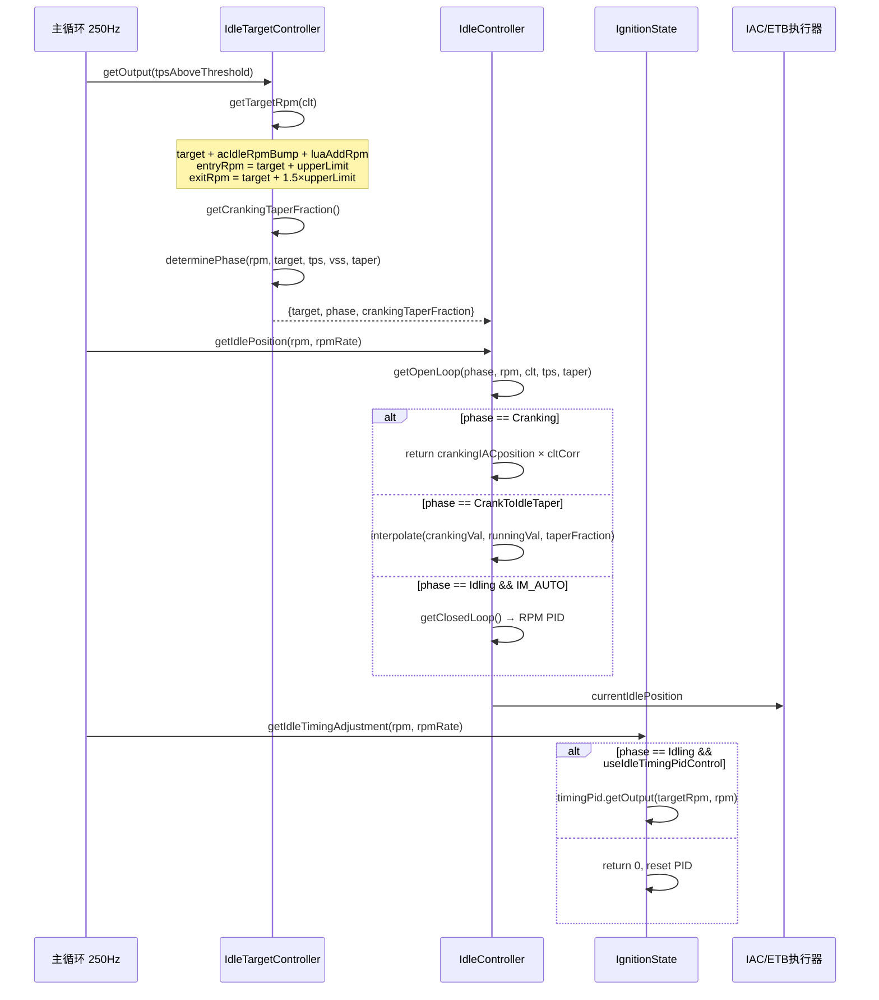

# 怠速控制场景分析

## 1. 场景描述

发动机在松开油门、空挡或离合器踩下时维持目标怠速转速。核心挑战是 AC、发电机、冷却风扇等负载突变对 RPM 的干扰。FOME 采用**双控制器 + 双 PID** 架构：IAC/ETB 调节进气量（慢但范围大），点火角微调（快但范围小）。

---

## 2. 数据流

```
主循环 250Hz
  ├─ IdleTargetController::getOutput()
  │    ├─ getTargetRpm(clt)           → 目标 RPM + 进入/退出阈值
  │    ├─ getCrankingTaperFraction()  → IAC 渐变比例
  │    └─ determinePhase()            → Cranking / Taper / Idling / Coasting / Running
  │
  └─ IdleController::getIdlePosition()
       ├─ getOpenLoop(phase, ...)     → 开环 IAC 位置
       ├─ getClosedLoop(phase, ...)   → RPM PID（仅 Idling 阶段）
       └─ 输出 IAC 位置 → stepper/ETB

  └─ IgnitionState::getIdleTimingAdjustment()  → 点火角 PID（仅 Idling）
       └─ 叠加到 getAdvance() 结果
```

---

## 3. 调用时序图



---

## 4. 状态机

```
                    Cranking
                        ↓  RPM ≥ cranking.rpm
              CrankToIdleTaper ← revolutionCounter / afterCrankingIACtaperDuration
                        ↓  taperFraction ≥ 1
Running ←────────→ Idling ←─────────→ Coasting
  TPS↑              TPS↓, RPM在窗口内    TPS↓, RPM > exitRpm
```

`determinePhase()` 实现：

```69:117:firmware/controllers/actuators/idle_thread.cpp
IIdleTargetController::Phase IdleTargetController::determinePhase(...) {
	if (!engine->rpmCalculator.isRunning()) {
		return Phase::Cranking;
	}
	if (tpsIsAboveIdleThreshold) {
		return Phase::Running;
	}
	if (rpm > targetRpm.IdleExitRpm ||
		!m_timeSinceCranking.hasElapsedSec(engineConfiguration->inhibitIdleAfterCrankingTime)) {
		looksLikeCoasting = true;
	} else if (rpm < targetRpm.IdleEntryRpm) {
		looksLikeCoasting = false;
	}
	if (looksLikeCoasting) {
		return looksLikeCrankToIdle ? Phase::CrankToIdleTaper : Phase::Coasting;
	}
	return Phase::Idling;
}
```

**滞回设计**：`IdleExitRpm = target + 1.5 × upperLimit`，`IdleEntryRpm = target + upperLimit`——退出怠速比进入怠速需要更高的 RPM，防止在阈值附近振荡。

---

## 5. 关键代码分析

### 5.1 目标 RPM 计算

```36:66:firmware/controllers/actuators/idle_thread.cpp
IIdleTargetController::TargetInfo IdleTargetController::getTargetRpm(float clt) {
	targetRpmByClt = interpolate2d(clt, config->cltIdleRpmBins, config->cltIdleRpm);
	targetRpmAcBump = acButtonState ? engineConfiguration->acIdleRpmBump : 0;
	auto target = targetRpmByClt + targetRpmAcBump + luaAddRpm;
	float entryRpm = target + rpmUpperLimit;
	float exitRpm = target + 1.5 * rpmUpperLimit;
	return {target, entryRpm, exitRpm};
}
```

AC 补偿基于**按钮状态**而非继电器状态——因为 AC 输出有延迟，提前 bump RPM 让 IAC 先增加进气。

### 5.2 开环 IAC 位置

```171:215:firmware/controllers/actuators/idle_thread.cpp
percent_t IdleController::getRunningOpenLoop(float rpm, float clt, SensorResult tps) {
	float running = manIdlePosition * interpolate2d(clt, config->cltIdleCorrBins, config->cltIdleCorr);
	running += acIdleExtraOffset;   // AC 进气补偿
	running += fan1ExtraIdle + fan2ExtraIdle;
	running += iacByTpsTaper;       // 松油门渐变
	running += iacByRpmTaper;       // 目标 RPM 变化渐变
	return clampF(0, running, 100);
}
```

起动→运行渐变：

```218:240:firmware/controllers/actuators/idle_thread.cpp
percent_t IdleController::getOpenLoop(Phase phase, ...) {
	if (isCranking) {
		return getCrankingOpenLoop(clt);  // crankingIACposition × cltCorr
	}
	percent_t running = getRunningOpenLoop(rpm, clt, tps);
	return interpolateClamped(0, crankingVal, 1, running, crankingTaperFraction);
}
```

### 5.3 RPM 闭环 PID

仅在 `Phase::Idling` 时激活，离开时复位：

```273:297:firmware/controllers/actuators/idle_thread.cpp
float IdleController::getClosedLoop(Phase phase, float rpm, float rpmRate, float targetRpm) {
	if (phase != Phase::Idling) {
		if (mightResetPid) {
			if (m_pid.getIntegration() <= 0 || alwaysResetPidLeavingIdle) {
				m_pid.reset();
			}
		}
		return 0;
	}
	m_pid.setDTermOverride(-rpmRate);  // 用 RPM 变化率增强 D 项
	return m_pid.getOutput(targetRpm, rpm, FAST_CALLBACK_PERIOD_MS / 1000.0f);
}
```

**负积分复位策略**：积分项为负（进气过多）时离开 Idling 会复位，防止下次进入时怠速过低甚至熄火。正积分保留——高负载后回到怠速可快速恢复。

### 5.4 点火定时辅助 PID

```247:261:firmware/controllers/actuators/idle_thread.cpp
float IdleController::getIdleTimingAdjustment(float rpm, float rpmRate, float targetRpm, Phase phase) {
	if (!engineConfiguration->useIdleTimingPidControl || phase != Phase::Idling) {
		m_timingPid.reset();
		return 0;
	}
	m_timingPid.setDTermOverride(-rpmRate);
	return m_timingPid.getOutput(targetRpm, rpm, FAST_CALLBACK_PERIOD_MS / 1000.0f);
}
```

提前角 ↑ → 燃烧更早 → 扭矩 ↑ → RPM ↑。响应时间 < 1 个发动机周期，远快于 IAC 的数百 ms。

### 5.5 与燃油系统的协调

IAC 改变进气量后，Speed-Density 或 MAF 模型在下一个 250 Hz 周期自动重新计算喷油量，维持目标 Lambda。IAC 和燃油无需显式协调——燃油系统跟踪 MAP/MAF 变化。

---

## 6. 常见问题

| 症状 | 可能原因 | 排查方向 |
|------|---------|---------|
| 怠速不稳 | PID 参数不当 | 检查 Kp/Ki；检查 IAC 阀响应 |
| 怠速过高 | 基本位置过高 | 检查 cltIdleCorr / manIdlePosition |
| 松油门熄火 | Coasting 策略不当 | 检查 iacCoasting 表 / AirTaper |
| 开空调熄火 | AC 补偿不足 | 增加 acIdleRpmBump / acIdleExtraOffset |

---

## 7. 设计权衡

- **快慢双 PID**：点火角处理瞬时干扰（AC 接合瞬间），IAC 处理稳态偏差——两者叠加而非互斥。
- **Coasting 与 Taper 互斥**：起动后 IAC 渐变期间不允许进入 Coasting 表，避免 IAC 位置跳变。
- **inhibitIdleAfterCrankingTime**：起动后一段时间内强制 Coasting 相位，防止 RPM 尚未稳定时过早进入闭环怠速。
