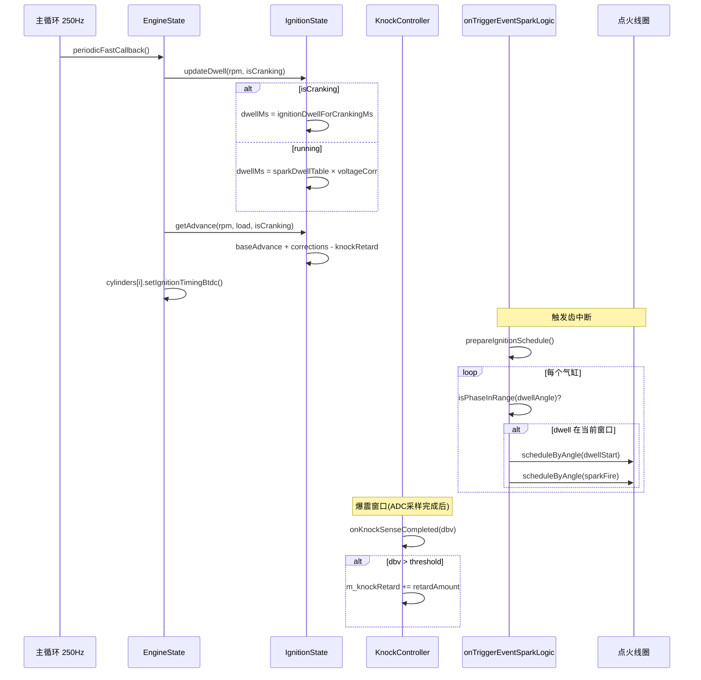

# 点火正时场景分析

## 1. 场景描述

在精确曲轴角度触发电火花，使燃烧压力峰值出现在上止点后 10–15°，最大化做功效率。FOME 采用**快速回调计算 + 触发回调调度**的双路径架构，与燃油控制类似。

---

## 2. 数据流

```
主循环 250Hz: EngineState::periodicFastCallback()
  ├─ ignitionState.updateDwell(rpm, isCranking)
  ├─ ignitionState.updateAdvanceCorrections(load)
  ├─ getAdvance(rpm, load, isCranking)
  │    ├─ 起动: getCrankingAdvance() → 独立表或线性过渡
  │    └─ 运行: getRunningAdvance() → ignitionTable 3D查表
  │    + getAdvanceCorrections() (IAT/CLT/怠速/DFCO)
  │    - knockRetard
  │    - torqueReduction
  └─ cylinders[i].setIgnitionTimingBtdc()

触发中断: onTriggerEventSparkLogic(phase)
  ├─ prepareIgnitionSchedule() 若未就绪
  └─ 对每个气缸:
       ├─ isPhaseInRange(dwellAngle) → scheduleByAngle(线圈充电)
       └─ scheduleByAngle(sparkAngle) → 跳火
```

---

## 3. 调用时序图



---

## 4. 关键代码分析

### 4.1 提前角计算

```186:210:firmware/controllers/algo/ignition/ignition_state.cpp
angle_t IgnitionState::getAdvance(float rpm, float engineLoad, bool isCranking) {
	if (isCranking) {
		angle = getCrankingAdvance(rpm, engineLoad);
	} else {
		angle = getRunningAdvance(rpm, engineLoad);
	}
	angle += getAdvanceCorrections(isCranking);
	wrapAngle(angle, "getAdvance", ObdCode::CUSTOM_ADCANCE_CALC_ANGLE);
	return angle;
}
```

起动过渡：从 `crankingTimingAngle`（默认 6° BTDC）线性插值到 `cranking.rpm` 处的运行表值：

```165:183:firmware/controllers/algo/ignition/ignition_state.cpp
static angle_t getCrankingAdvance(float rpm, float engineLoad) {
	angle_t crankingToRunningTransitionAngle = getRunningAdvance(engineConfiguration->cranking.rpm, engineLoad);
	return interpolateClamped(minCrankingRpm, engineConfiguration->crankingTimingAngle,
							  engineConfiguration->cranking.rpm, crankingToRunningTransitionAngle, rpm);
}
```

修正项仅在 `timingMode == TM_DYNAMIC` 时生效，起动时默认不加修正（除非 `useAdvanceCorrectionsForCranking`）。

### 4.2 Dwell 控制

```258:262:firmware/controllers/algo/ignition/ignition_state.cpp
floatms_t IgnitionState::getSparkDwell(float rpm, bool isCranking) {
	if (isCranking) {
		dwellMs = engineConfiguration->ignitionDwellForCrankingMs;  // 固定 6ms
	} else {
		baseDwell = interpolate2d(rpm, sparkDwellRpmBins, sparkDwellValues);
		dwellMs = baseDwell * dwellVoltageCorrection;
	}
}
```

运行模式：Dwell 角度 = `dwellMs × rpm × 6 / 1000`。若 Dwell 角度超过可用窗口，触发 **Underdwell 保护**——自动推迟点火角或跳过本次点火。

### 4.3 触发回调中的点火调度

```422:496:firmware/controllers/engine_cycle/spark_logic.cpp
void onTriggerEventSparkLogic(const EnginePhaseInfo& phase) {
	if (!engineConfiguration->isIgnitionEnabled) return;
	const floatms_t dwellMs = engine->ignitionState.getDwell();
	if (!engine->ignitionEvents.isReady) {
		prepareIgnitionSchedule();
	}
	for (size_t i = 0; i < cylindersCount; i++) {
		if (!isPhaseInRange(EngPhase{dwellAngle}, phase)) {
			continue;  // dwell 不在当前齿窗口，等下次
		}
		angle_t sparkAngle = event.calculateSparkAngle();
		// 弹射/扭矩限制/ALS 可能 skip
		scheduleByAngle(nullptr, phase.timestamp, angleFromNow, {&startCoilCharge, ctx});
		scheduleByAngle(nullptr, sparkTime, sparkAngleFromNow, {&fireSpark, ctx});
	}
}
```

**要点**：Dwell 开始和跳火分别按角度调度；每个触发齿检查当前窗口内是否有待执行的事件。

### 4.4 爆震检测与响应

```57:94:firmware/controllers/engine_cycle/knock_controller.cpp
bool KnockControllerBase::onKnockSenseCompleted(uint8_t cylinderNumber, ..., float dbv, ...) {
	dbv += m_gain[cylinderNumber];
	bool isKnock = dbv > m_knockThreshold;
	if (isKnock) {
		auto baseTiming = engine->cylinders[cylinderNumber].getIgnitionTimingBtdc();
		auto distToMinimum = baseTiming - (-20);
		auto retardAmount = distToMinimum * knockRetardAggression * 0.01f;
		m_knockRetard = clampF(0, m_knockRetard + retardAmount, m_maximumRetard);
	}
	return isKnock;
}
```

`m_knockRetard` 在 `getAdvanceCorrections()` 中减去，影响所有气缸。无爆震时按 `knockRetardReapplyRate` 逐渐恢复。

### 4.5 多火花

```218:252:firmware/controllers/algo/ignition/ignition_state.cpp
size_t getMultiSparkCount(float rpm) {
	if (multisparkEnable && rpm <= multisparkMaxRpm && rpm != 0) {
		float additionalSparksUs = usPerDegree * multisparkMaxSparkingAngle;
		float oneSparkTime = multiDelay + multiDwell;
		return minI(floor(additionalSparksUs / oneSparkTime), multisparkMaxExtraSparkCount);
	}
	return 0;
}
```

RPM = 0 时禁用多火花——转速未知时不安全。

---

## 5. 点火模式

| 模式 | 硬件 | 特点 |
|------|------|------|
| 独立点火 (COP) | 每缸一个线圈 | 最灵活，支持逐缸爆震 |
| 浪费点火 (Wasted Spark) | 每两缸一个线圈 | 排气上止点也跳火 |
| 单线圈+分电器 | 一个线圈 | 成本最低 |

奇数缸 Wasted Spark 特殊处理：检查 360° 后的 dwell 事件是否在当前窗口，若是则提前执行（`spark_logic.cpp` 第 466–481 行）。

---

## 6. 与燃油喷射的相位关系

```
进气行程 → 压缩行程 → 做功行程 → 排气行程
   ↑            ↑           ↑
 喷油结束    点火触发    压力峰值
 (IOT前)     (TDC前)    (TDC后10-15°)
```

---

## 7. 设计权衡

- **Dwell 用 ms 而非纯角度（起动）**：低 RPM 时角度 dwell 极长，线圈过热。固定 ms 保证火花能量一致。
- **爆震退角全局共享**：简化实现，所有气缸同步退角；逐缸退角需要更复杂的调度。
- **Underdwell 保护优先于性能**：宁可推迟点火也不发出能量不足的火花——失火比稍晚点火危害更大。
