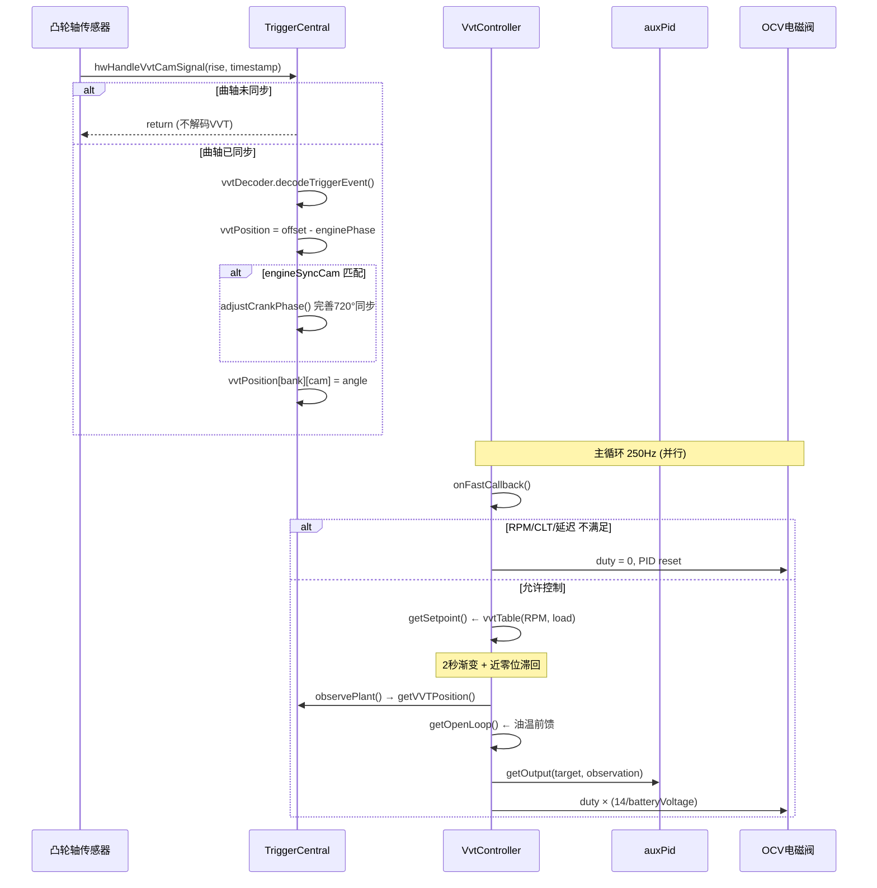

# VVT 控制场景分析

## 1. 场景描述

可变气门正时 (VVT) 通过 OCV（机油控制阀）调节凸轮轴相位，优化不同工况下的气门正时。FOME 支持最多 4 路 VVT（2 缸组 × 进/排气），每路独立的 PID 闭环控制。

---

## 2. 数据流

```
凸轮轴传感器边沿 (中断)
  └─ hwHandleVvtCamSignal()
       ├─ 曲轴必须已同步 (getShaftSynchronized)
       ├─ vvtDecoder.decodeTriggerEvent()
       ├─ vvtPosition = vvtOffset - currentEnginePhase
       └─ triggerCentral.vvtPosition[bank][cam]  ← 反馈值

主循环 250Hz: VvtController::onFastCallback()
  ├─ 启用条件: RPM > minRpm, CLT > minClt, 起动后 > activationDelay
  └─ ClosedLoopController::update()
       ├─ getSetpoint()     → vvtTable(RPM, load) 目标角度
       ├─ observePlant()    → getVVTPosition(bank, cam)
       ├─ getOpenLoop()     → vvtOpenLoop(油温/水温) 前馈
       ├─ getClosedLoop()   → PID(目标角, 实际角)
       └─ setOutput()       → OCV PWM (含电压补偿)
```

---

## 3. 调用时序图



---

## 4. 关键代码分析

### 4.1 凸轮信号解码

VVT 解码**依赖曲轴已同步**——没有曲轴相位参考，凸轮齿角度无意义：

```272:275:firmware/controllers/trigger/trigger_central.cpp
	if (!tc->triggerState.getShaftSynchronized()) {
		return;
	}
```

位置计算：

```311:364:firmware/controllers/trigger/trigger_central.cpp
	auto vvtPosition = engineConfiguration->vvtOffsets[bankIndex * CAMS_PER_BANK + camIndex] - currentEnginePhase.angle;
	vvtPosition = wrapVvtForCamType(vvtPosition, engineConfiguration->vvtMode[camIndex]);

	if (tc->triggerState.hasSynchronizedPhase()) {
		vvtPos.angle = vvtPosition;
		vvtPos.t.reset(nowNt);
	}
```

**公式**：`实际VVT角 = 配置偏移 - 凸轮齿出现的发动机相位`。偏移在标定时确定，代表凸轮在默认（0° VVT）位置时的理论角度。

### 4.2 发动机同步辅助

指定 `engineSyncCam` 的凸轮传感器可帮助确定 720° 周期中的压缩行程：

```336:346:firmware/controllers/trigger/trigger_central.cpp
	if (index == engineConfiguration->engineSyncCam) {
		bool hadFullSyncBefore = tc->triggerState.hasSynchronizedPhase();
		angle_t crankOffset = adjustCrankPhase(camIndex);
		if (!hadFullSyncBefore && hadFullSyncAfter) {
			vvtPosition -= crankOffset;  // 曲轴相位修正后同步修正VVT读数
		}
	}
```

无 VVT 时曲轴转两圈才能确定相位；有一个凸轮齿信号即可在首圈确定。

### 4.3 目标角度与启用条件

```49:66:firmware/controllers/actuators/vvt.cpp
void VvtController::onFastCallback() {
	m_isRpmHighEnough = Sensor::getOrZero(SensorType::Rpm) > engineConfiguration->vvtControlMinRpm;
	m_isCltWarmEnough = Sensor::getOrZero(SensorType::Clt) > engineConfiguration->vvtControlMinClt;
	m_engineRunningLongEnough = rpmCalculator.getSecondsSinceEngineStart() > vvtActivationDelayMs;
	update();
}
```

目标角度查表 + 2 秒渐变 + 近零位滞回：

```97:137:firmware/controllers/actuators/vvt.cpp
expected<angle_t> VvtController::getSetpoint() {
	float target = m_targetMap->getValue(rpm, load);
	target = interpolateClamped(0, 0, 2, target, m_timeSinceEnabled.getElapsedSeconds());
	// 目标 < 3° 时停止控制，避免顶到机械限位
	if (m_targetHysteresis.test(target > 3, target < 1)) {
		return target;
	}
	return unexpected;
}
```

### 4.4 开环前馈（油温补偿）

```145:160:firmware/controllers/actuators/vvt.cpp
expected<percent_t> VvtController::getOpenLoop(angle_t /* target */) {
	float temp = Sensor::get(SensorType::OilTemperature).value_or(
		Sensor::get(SensorType::Clt).value_or(80));
	return interpolate2d(temp, config->vvtOpenLoop[m_cam].bins, config->vvtOpenLoop[m_cam].values);
}
```

机油粘度随温度变化 → OCV 流量变化 → 相同占空比产生不同的相位变化率。前馈按油温预置基础占空比。

### 4.5 闭环 PID 与输出

```163:174:firmware/controllers/actuators/vvt.cpp
expected<percent_t> VvtController::getClosedLoop(angle_t target, angle_t observation) {
	m_pid.setErrorAmplification(isInverted ? -1.0f : 1.0f);
	return m_pid.getOutput(target, observation, FAST_CALLBACK_PERIOD_MS / 1000.0f);
}
```

输出含电池电压补偿：

```177:201:firmware/controllers/actuators/vvt.cpp
void VvtController::setOutput(expected<percent_t> outputValue) {
	if (outputValue && enabled) {
		float voltageRatio = 14 / clampF(10, batteryVoltage, 24);
		vvtPct *= voltageRatio;  // 低电压时增大占空比
		vvtPct = clampF(vvtOutputMin, vvtPct, vvtOutputMax);
		m_pwm->setSimplePwmDutyCycle(PERCENT_TO_DUTY(vvtPct));
	} else {
		m_pwm->setSimplePwmDutyCycle(0);
		m_pid.reset();
	}
}
```

### 4.6 反馈读取

```89:94:firmware/controllers/actuators/vvt.cpp
expected<angle_t> VvtController::observePlant() const {
	return engine->triggerCentral.getVVTPosition(m_bank, m_cam);
}
```

VVT 位置由中断上下文更新，主循环读取。超过 1 秒无新数据 → 传感器超时 → `observePlant()` 返回 `unexpected` → 输出归零。

---

## 5. 典型控制策略

| 工况 | 进气 VVT | 效果 |
|------|---------|------|
| 低速/低负荷 | 早关 (负角度) | 减少重叠，怠速稳定 |
| 中速/中负荷 | 晚关 (正角度) | 进气惯性充气，提高 VE |
| 高速/高负荷 | 排气早开 | 排气充分，提高功率 |
| 部分负荷 | 增大重叠 | 内部 EGR，减少泵气损失 |

---

## 6. 限制与保护

- `vvtControlMinRpm` 默认 ≥ `cranking.rpm`（`initVvtActuators` 强制）
- 目标近零位时停止控制（避免顶机械限位 / 锁销卡死）
- 传感器超时 → 输出 0，PID 复位
- 2 秒目标渐变防止起动后立即大幅调节

---

## 7. 设计权衡

- **VVT 解码必须在曲轴同步后**：这是物理约束——凸轮相位是相对曲轴定义的。
- **近零位滞回**：许多 VVT 系统的锁销在零位附近，强行控制会导致锁销故障。
- **电压补偿**：OCV 是电磁阀，占空比代表电流，低电压时需要更高占空比维持相同电流。
